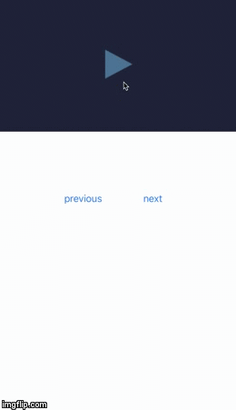
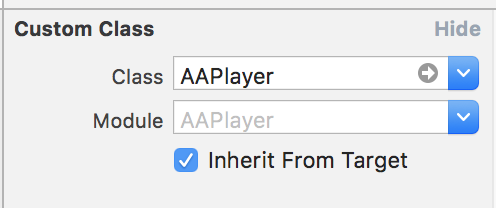
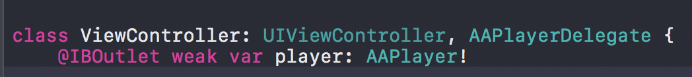

# AAPlayer

#### Customize Video Player base on AVPlayer 


# Feature

- [x] Pure swift 3.1 code
- [x] Use UIGraphics to draw icons for buttons
- [x] Supported video formats : HLS, mp4
- [x] Require iOS 8 or later

#### Playing Status



# Installation

#### CocoaPods

AAPlayer is available through [CocoaPods](http://cocoapods.org).

Simply add AAPlayer to your `Podfile`.

```
pod 'AAPlayer'
```
Enter command instruction into your terminal.

```
pod install
```
# Usage

You must create UIView and it use custom class in the storyboard after install AAPlayer.



Then you must also create a IBOutlet in your UIViewController Class with AAPlayerDelegate.



The following sample code for your reference.

```swift 
    override func viewDidLoad() {
        super.viewDidLoad()
     
        sourceArray = ["http://clips.vorwaerts-gmbh.de/VfE_html5.mp4","http://live.zzbtv.com:80/live/live123/800K/tzwj_video.m3u8","http://devimages.apple.com/iphone/samples/bipbop/bipbopall.m3u8","http://bos.nj.bpc.baidu.com/tieba-smallvideo/0173bbaf5acf62b815a7de0544730d6c.mp4","http://bos.nj.bpc.baidu.com/tieba-smallvideo/00a52c5e2213216ce0ce3795d40e9492.mp4","http://bos.nj.bpc.baidu.com/tieba-smallvideo/0045ab5a9e440defb2611658c0914724.mp4"]
        player.delegate = self
        player.playVideo(sourceArray[currentIndex] as! String)
    }
```

```swift
    //optional method
    func callBackDownloadDidFinish(_ status: playerItemStatus?) {
        
        let status:playerItemStatus = status!
        switch status {
        case .readyToPlay:
            break
        case .failed:
            break
        default:
            break
        }
    }

```

```swift   
    func startPlay() {
        //optional method
        player.startPlayback()
    }
    
    func stopPlay() {
        //optional method
        player.pausePlayback()
    }

```
# License

AAPlayer is available under the MIT license. See the LICENSE file for more info.
